# RISC-V ESC Base on CH32V203F8U6

* [Introduction](https://github.com/openwch/RISC-V_ESC#Introduction) 
* [Hardware](https://github.com/openwch/RISC-V_ESC#Hardware) 
* [Config](https://github.com/openwch/RISC-V_ESC#Config) 
* [Test](https://github.com/openwch/RISC-V_ESC#Test) 

## Introduction
The AM32 firmware has been ported to the RISC-V platform, and the main controller has chosen CH32V203F8U6, which is highly cost-effective. It can be compiled directly on MRS. At the same time, the bootloader program has been ported, and tool of Esc_Config_Tool_1_82_WIN can be used to configure and upgrade firmware for ESC.

## Hardware

### MCU
The resources of MCU are shown in the following figure,You can see that it has many peripheral resources.For more information, you can refer to the [wch](https://www.wch-ic.com/products/CH32V203.html?). 

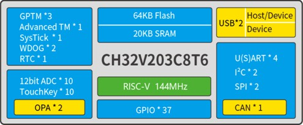

But for ESC design, it cannot use all the peripherals. Therefore, I choose a QFN20(3mm*3mm) packaged chip CH32V203F8U6. The size is very small and the price is cheap. 

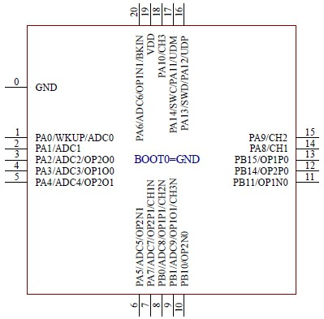

### System Block Diagram
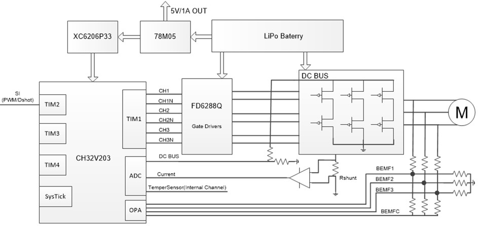

Using TIM1 to output 3 sets of complementary PWM for driving MOSFEET, Using TIM2 for capturing external throttle signals, Using ADC to sample voltage, current, and temperature for low voltage protection, over current protection, and over temperature protection. Using internal OPA and BEMF to estimate rotor position. TIM3 and TIM4 is used to calculate commutation time and motor timing. Systick is used to complete some periodic tasks.

### PINS
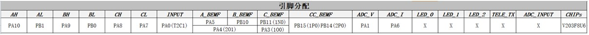

AH AL BH BL CH CL:  TIM1 PWM outputs; 
INPUT: TIM2 Channel1  used to capture external throttle signals; 
A_BEMF: A-Phase BEMF, connect to the negative end-1 of OPA2(PA5); 
B_BEMF: B-Phase BEMF, connect to the negative end-0 of OPA2(PB10); 
C_BEMF: C-Phase BEMF, connect to the negative end-0 of OPA1(PB11); 
CC_BEMF: Neutral point BEMF, connect to the positive end-0 of OPA2(PB14) and positive end-0 of OPA1(PB15); 
ADC_V: Voltage sampling channel; 
ADC_I: Current sampling channel; 
 
In order to unify the interrupt entry of OPA, the outputs of OPA1(PA3) and OPA2(PA4) are merged into PA2, Using external interrupts of PA2 for zero crossing comparison processing. **Individual external interrupts can also be used to save one GPIO(PA2)** 

PA13 and PA14 are used to download bootloader  via WCH-LINKE. If necessary, the program can also reuse these two ports. 

For detailed information, please refer to the [schematic diagram](https://github.com/openwch/RISC-V_ESC/blob/main/docs/SCH_AM32_V203F8U6.pdf), **NOTE: The current schematic does not enable current sampling. If desired, simply amplify the current and connect the signal to PA6.** 

## Config

### Flashing BootLoader
1. For empty chips, BootLoader needs to be flashed via WCH-LINKE, Connect according to the diagram below.

   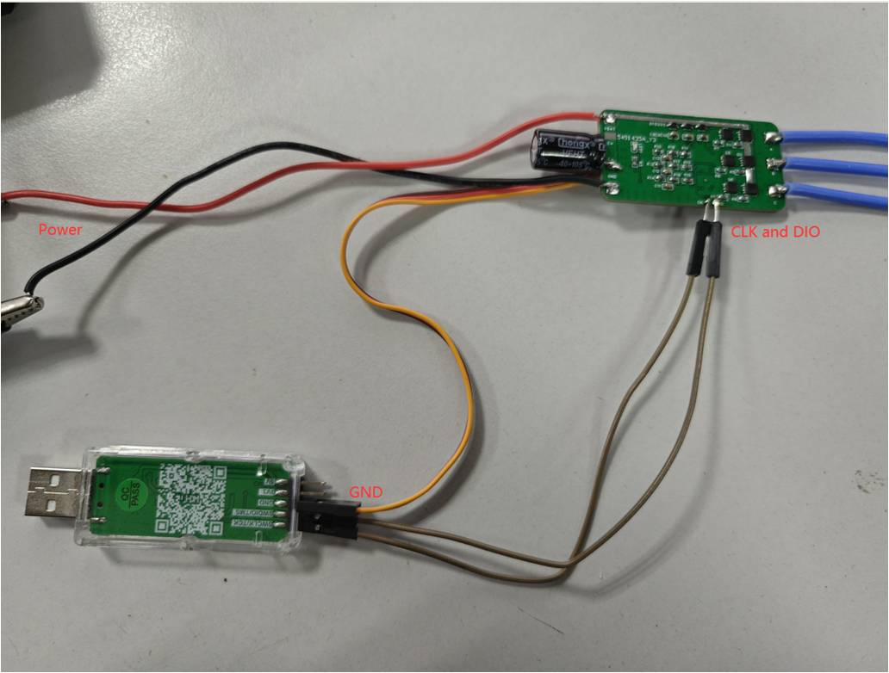
   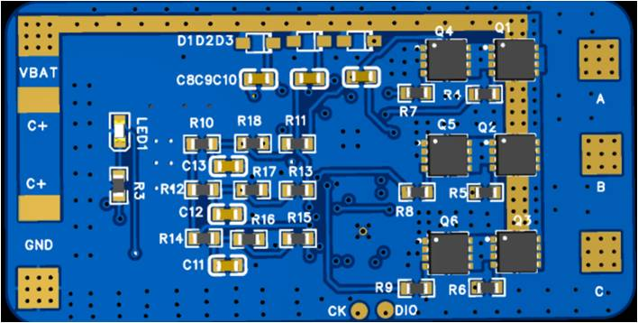

2. Open the [Bootloader project](https://github.com/TianpeiLee/CH32V203_AM32_Bootloader) using MRS and download it directly after compilation.

    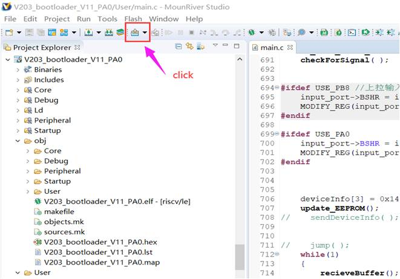

3. Use a [one-wire serial port](https://github.com/TianpeiLee/OneWireUSART) to connect to ESC and use tools to configure and update firmware. I used CH32V003 to perform a software conversion, and the wiring is shown in the following figure.

    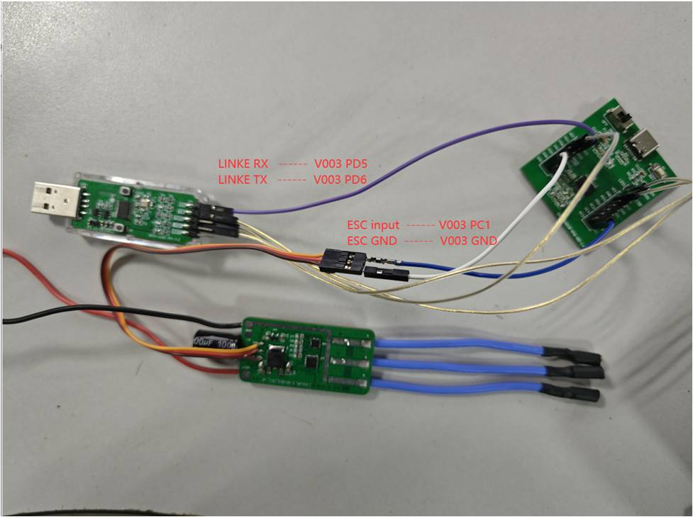

    If the Bootloader is burned correctly, Open the configuration tool ***Esc_Config_Tool_1_82_WIN.exe*** and power on the ESC. Follow the steps in the following figure to click. When connecting for the first time, *'No EEprom'* will be displayed!
    
    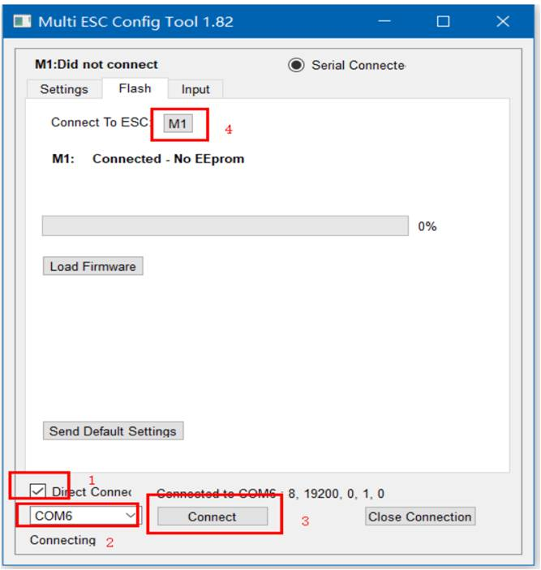

    Directly click on ***Send Default Settings*** below to burn the default values. After successful burning, power on again. Connect again and click ***M1***. The default parameters we just burned will be displayed.

    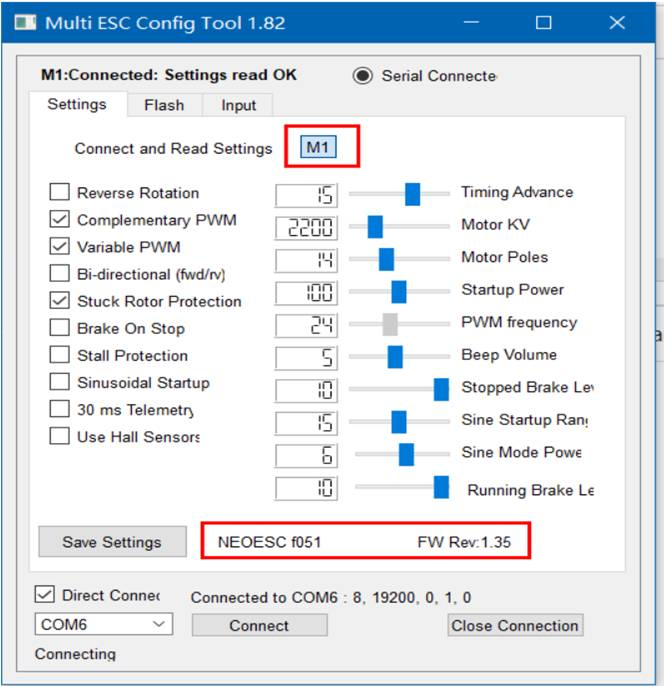

4. Flashing firmware and configurations
   
   Returning to the FLASH interface of the tool, we click on ***Load Firmware***, select the firmware we compiled in MRS, and the ***FLash Firmware*** button will pop up. Click to start updating the program. 

    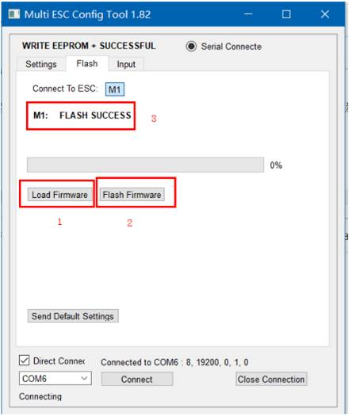

    After the update is completed, power on again and connect ESC again to configure ESC. The specific meaning of configuration values can be found in the following [links](https://github.com/AlkaMotors/AM32-MultiRotor-ESC-firmware/wiki/ESC-Settings-Explained).

    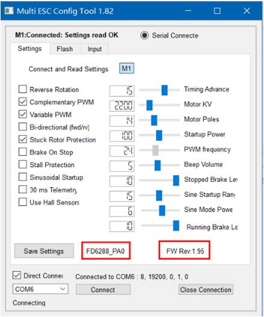

## Test

The version I ported is V1.95, which supports signals such as dshot300, dshot600, and PWM. To test ESC, I used CH32V003 to create a [servo testing tool](https://github.com/TianpeiLee/ServoTestTool). You can connect it directly to the ESC to test.

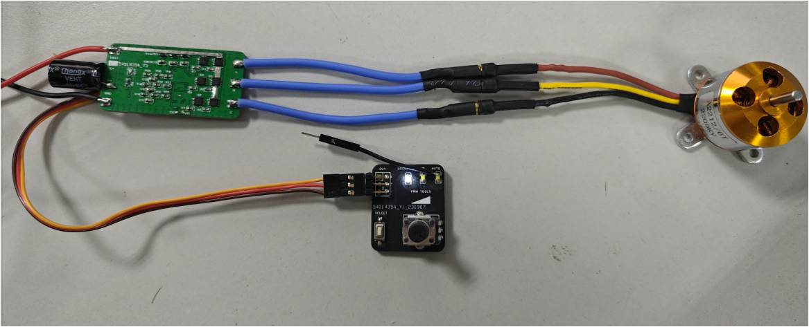  

### ESC Test
This video demonstrates the running of ESC under different signal input conditions. 
[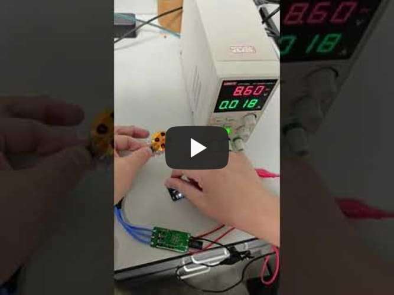](https://youtu.be/h0iekUh7lSY)

### Output signal of servo testing tool
This video demonstrates three different output signals of a servo testing tool. 
[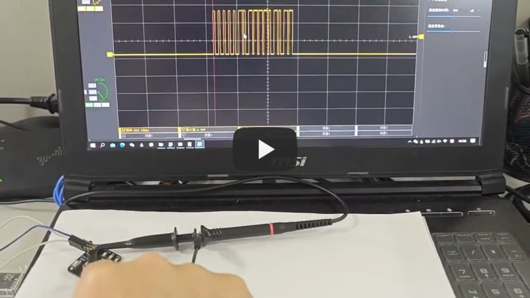](https://youtu.be/FwIuJzSEXmE)

